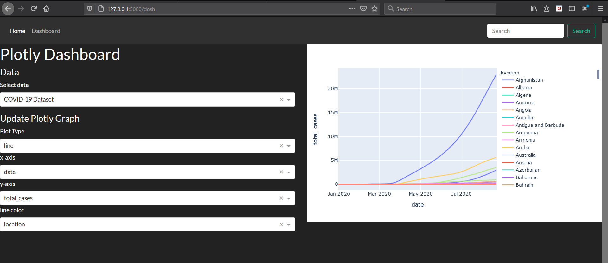

# ML COVID App
#### *Hadley Rose Mitchell 08/24/2020*

Dash-embedded Flask app for visualizing COVID-19 data and applying basic ML techniques.

**TODOs**:

- [ ] *Plotly Dash:* preview data option, data preview in modal?  
- [ ] *Plotly Dash:* multi select drop down on which columns to include in plotly? one for each feature of plotly? x, y, color, etc.?  
- [ ] *Plotly Dash:* add progress bar for all steps that take some time to load (plotly, data upload)  
- [ ] *ML:* option for prophet prediction, prophet graph  
- [ ] *ML:* option to generate predictions to csv  
- [ ] *ML:* option to do other ML and select which parts of data to use, warnings based on data type  
- [ ] *Flask:* make prettier  
- [ ] *Plotly Dash/ML:* how to handle nans?  
- [ ] Clean up README